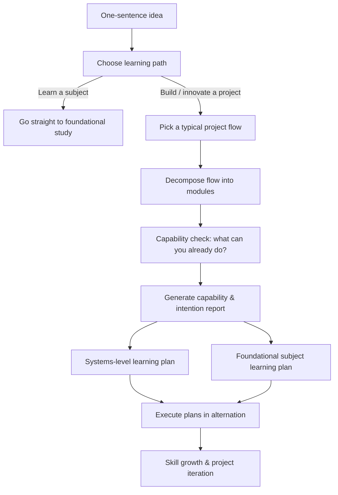
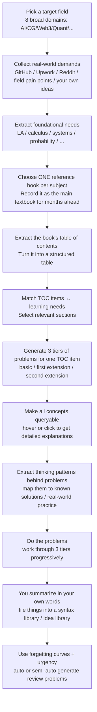
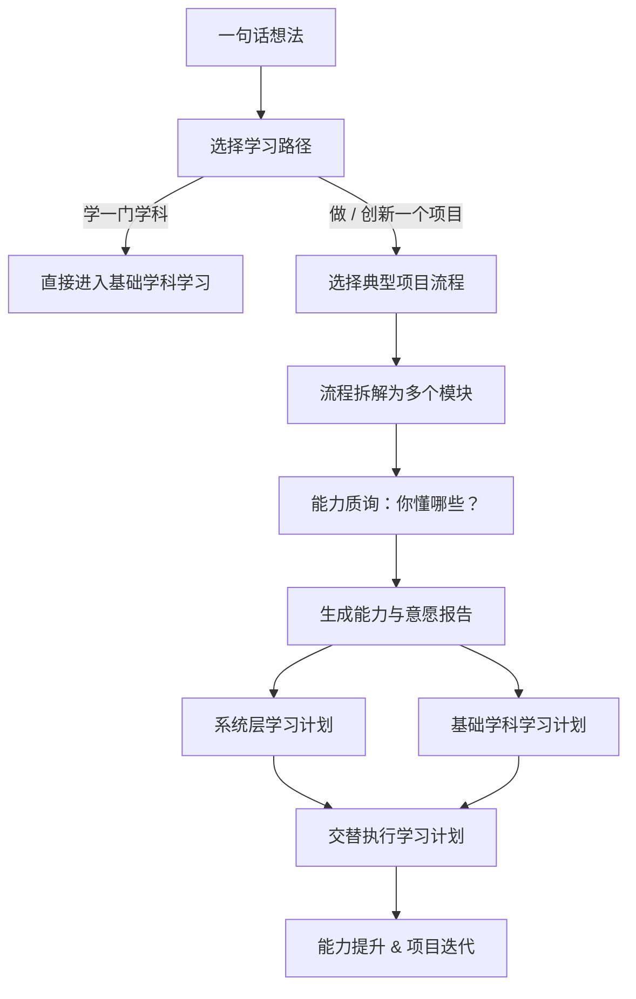
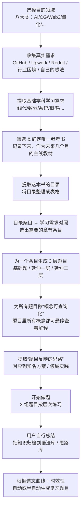

# Substrate: an experimental top‑down AI self‑learning tool

> This is a learning tool I’m building for my “future self” to go from 0 to working in areas like AI, CG, Web3, quant, game dev, big data, security engineering, and data engineering.

**中文说明 / Chinese Version:** [Jump to Chinese section](#substrate-chinese-version)

---

## Who this project is *not* for

Let me start with who probably shouldn’t spend time on this:

1. People who expect AI to do all the work for them, and who have no interest in long‑term (and quite possibly boring) self‑driven study.
2. People who have zero interest in AI, CG, Web3, quant, game dev, big data, security engineering, or data engineering.
3. Established experts in these fields (you almost certainly already have better methods than mine).
4. Anyone who already has a mature, well‑tested personal learning system that works great for them.

If you don’t see yourself in the list above, and you’re willing to grind on your own for a while, feel free to read on.

---

## Why this project exists

Three main things pushed me into building this:

1. I’ve been using a “top‑down” learning approach for years: start from a project I want to ship, then work backwards to the system skills and foundational subjects I actually need. Now I want to hand that whole workflow to an agent, cut out the repetitive, messy AI‑prompting overhead, and increase my own learning efficiency.
2. Most AI products today are built as amplifiers for existing experts, not as tools that help a student go from 0 → 1. I want to experiment with an agent + prompt‑engineering approach that’s more friendly to self‑learners.
3. I also need a framework that **stops me from hiding behind “complex process” as an excuse to slack off**. This project is very personal; the learning flows below are basically the exact routes I’d take myself.

---

## Design idea: fighting the “slope effect”

I use “slope effect” to describe a very specific kind of pain beginners hit:

- From 0 to “I can run a real project once” there’s a long, steep slope.
- On that slope there are a lot of “one‑way doors”: you have to swallow a huge chunk of concepts or write a ton of code *before* you see any feedback.
- Most people drop out on this stretch, not because they’re not smart enough, but because the feedback comes too late and each step is too tall.

What Substrate tries to do is pretty simple:

> Take that long steep slope and turn it into many small steps, each with feedback, and always decompose **from the project you care about** downward — instead of climbing up from a textbook table of contents.

---

## High‑level flow

The core flow can be summarized in one line:

> One‑sentence idea → pick a typical project flow → capability check → generate learning appetite → learning plan (systems level + foundational subjects) → alternating self‑study.

In Mermaid, it looks roughly like this:



---

## How I study foundational subjects: from goals to exercises and review

This part does *not* start from textbook chapters. It starts from **the field you want to enter and the real problems you want to solve**, then works backward to which foundational subjects you need and how deep you need to go.

### Visual flow (foundational side)



(What follows is a more detailed explanation that lines up with this diagram.)

---

## Usage flow (current vision)

### 1. Entry: pick a path

First, you choose one of two paths:

- “Learn a subject”:  
  - For example, “I want to systematically fix my linear algebra basics”.  
  - In this case, you go straight into the foundational‑subject flow and **skip** the project‑analysis flow (steps 3–5 below).
- “Build / innovate a project”:  
  - For example, “I want to build or reinvent a scheduling module”.  
  - In this case, you go through the full project‑analysis flow.

Then you drop a one‑sentence description of your idea or project into the chat box.

---

### 2. AI confirms your flow (match a typical project)

The system looks up internal data and pulls out a few **typical project flows** that might match what you wrote.

If you say “I want to build a scheduling module”, you might see flows like:

- Flow A: single‑user scheduling focused on simple time blocks and reminders.
- Flow B: multi‑user scheduling with assignments and calendar syncing.
- Flow C: “smart” scheduling with priorities and automatic rescheduling.

You pick the one closest to what you have in mind (you can customize later).

---

### 3. From “one project” to “many modules”

Once a flow is chosen, the AI decomposes it into ordered modules with different underlying technologies, and sketches each module.

For a “typical scheduling system” (just an example), modules might be:

- Module 1: Capture and parse user input (natural language / forms).  
- Module 2: Time and date parsing (“tomorrow at 3 pm” → timestamps).  
- Module 3: Conflict detection and resolution (collisions, priorities).  
- Module 4: Storage and data structures (DB / files / cloud storage).  
- Module 5: Reminders and notifications (local, email, push).  
- Module 6: UI & interaction (web / app / CLI).

At the same time, the system tries to gather for each module:

- How commoditized it is in the wild.  
- Common community pain points.  
- Classic innovation ideas.  
- The rough tech stack involved.

---

### 4. First capability check: where are you right now?

Next to each module, you see its key technologies and a simple question:

- “Do you know technology X?”  
- “Have you ever built something like Y?”

If you click “no”:

- Nothing explodes; the system just marks this module as “not yet covered”.

If you click “yes”:

- You get a tiny set of short true/false or multiple‑choice questions related to that tech.  
- If you get them right, the module is marked as “passed”.  
- If not, it’s marked with a question mark (“needs review”).

The goal is not an exam. It’s to honestly see:

> “For this dream project, how many modules could I *actually* modify today, and how many are a total blank?”

---

### 5. Dive into modules and generate “learning appetite”

For any module you can click in and see:

- How commoditized it is across platforms (how “red‑ocean” it is).  
- Community feedback and common complaints.  
- Interesting, innovative projects in this space.  
- A preview of where the related code lives and what it roughly does.

Then, for each module, you explicitly choose how deep you want to go:

- “Just enough to get by”  
- “Comfortable and fluent”  
- “Deep understanding with room to innovate”

This is what I call “learning appetite”: not a vague “I want to be better”, but a per‑module depth preference.

---

### 6. Capability & intention report

Based on:

- Your capability checks (pass / question mark / blank).  
- Your chosen “depth appetite” for each module.

The system generates a short report:

- Which modules you can already work on to some extent.  
- Which ones are completely blank but you’re hungry to go deep on.  
- Which ones can stay at “good enough” for now.

It also suggests a rough order or rhythm (not a rigid schedule, more of a sequence suggestion).

---

### 7. Learning plan: systems‑level + foundational subjects

The plan splits into two intertwined tracks:

1. Systems‑level learning  
   - Starting from real projects, it helps you **understand how an actual stack or project behaves end‑to‑end**.  
   - It follows four principles (names may change later):  
     - Visual: use diagrams wherever possible, not walls of text.  
     - Comprehensive: explain not only functions, but also environment, entry/exit points, and data flow.  
     - Goal‑anchored: every explanation is tied back to something you want to build or improve.  
     - Stepwise: fight the slope effect by turning big jumps into many small steps with feedback.

2. Foundational‑subject learning  
   - When the system sees that you’re blocked at a concept level on some module, it routes you into the foundational track.  
   - The flow (still evolving) includes: picking a single main book, extracting its TOC, selecting relevant sections, generating 3‑tier problem sets (basic / extension 1 / extension 2), and managing practice + review.

In the end you get a **living, adjustable learning plan**. You can try to follow it, or simply use it as the record of the path you actually take.

---

## Technologies (current / planned)

This will change as the project evolves; for now it’s just rough direction:

- Language & core: Python  
- Web / API layer: FastAPI or similar  
- Data storage: SQLite / Postgres (depending on complexity)  
- AI capabilities: OpenAI‑style LLM APIs, vector DBs, etc.  
- Scraping / data collection: Requests, Playwright, and friends  
- Frontend / UX: undecided (most likely starting with a very bare‑bones web UI or CLI)

---

## Current status & expectations

This is still very much an experimental project:

- [ ] Build a minimal “project‑flow decomposition + capability check” prototype  
- [ ] Plug in one of my real projects (e.g., some API service) and run a full systems‑learning path on it  
- [ ] Design and implement the first foundational learning flow (for example, a small slice of linear algebra)

I’ll prioritize whatever helps *my own* learning the most first, and only then worry about whether it’s useful to anyone else.

---

## How to run it (very rough placeholder)

> Important: this is just a *future* usage sketch. I’ll update it when things stabilize.

```bash
git clone https://github.com/yourname/substrate.git
cd substrate

# create a virtualenv / use uv / poetry / etc.
# install dependencies
pip install -r requirements.txt

# run (example)
python main.py
```

Exact commands will be updated once the actual code is in place.

---

## A few personal notes

- This project is first and foremost for my “future self”, and it reflects a lot of personal bias.  
- It doesn’t promise to help anyone, and it certainly doesn’t guarantee learning outcomes.  
- If you also like starting from projects, decomposing downward, and are willing to climb slowly, you might find something here.  
- If this feels completely wrong for you, that’s fine — the world *should* have many different ways to learn.

You’re welcome to fork it, roast it, or just treat it as a weird public learning diary.
```
```
## Substrate Chinese Version

# Substrate：一个实验性的自上而下 AI 自学工具

> 这是我做给“未来的自己”的学习工具，用来帮我从 0 自学 AI / CG / Web3 / 量化 / 游戏开发 / 大数据 / 安全工程 / 数据工程等领域。

---

## 这个项目不适合谁

先说清楚谁不需要浪费时间在这上面：

1. 指望 AI 帮你完成全部工作、对长时间（而且很可能相当枯燥）的自学提升没有意愿的人。
2. 对 AI、CG、Web3、量化、游戏开发、大数据、安全工程、数据工程这些方向完全没兴趣的人。
3. 这些领域里的成熟专家（你大概率比我更有成熟的方法）。
4. 已经有一套自己非常顺手、成熟学习方法的人。

如果你刚好不在上面这几类里，而且愿意自己啃一段时间，那欢迎继续往下看。

---

## 这个项目为何而来

主要有三件事把我逼到了这里：

1. 我一直在用一种“自上而下”的学习方法：从想实现的项目出发，反推需要的系统能力和基础学科。现在想把这一整套方法交给一个 agent 来做，削减重复、繁琐的 AI 信息同步流程，提升自学效率。
2. 现在的大多数 AI 产品，更像是各领域专家的增幅器，而不是帮助一个学生从 0→1 构建能力。我想尝试用 agent 形式 + 提示词工程，做一个对“自学者”更友好的工具。
3. 我也需要一个能**逼自己少偷懒**的框架，而不是一堆繁琐流程当借口。这个项目会非常个性化，下面的学习流程基本就是我真实会走的路线。

---

## 设计理念：对抗“爬坡效应”

我把初学者遇到的那种卡关，统称为“爬坡效应”：

- 从 0 到第一次跑通一个真实项目，中间有一段又陡又长的坡。
- 坡上有很多“单向门”：你得先接受一整坨概念 / 写一大段代码，才能看到一点反馈。
- 多数人在这段路上被劝退，不是因为不够聪明，而是因为反馈太晚、台阶太高。

Substrate 想做的事情很简单：

> 把这条长坡拆成一阶一阶的小台阶，每一步都有反馈，并且始终从“你想做的项目”往下拆，而不是从教科书目录往上爬。

---

## 整体流程概览

核心流程可以用一句话概括：

> 一句话想法 → 选择一个典型项目流程 → 能力质询 → 生成学习欲望 → 学习计划（系统层 + 基础学科） → 交替自学。

用一个简单的流程图表示大致长这样：


## 基础学科学习方法：从目的到题目与复习

这一部分不从“教科书章节”出发，而是从**你想进入的领域 / 你要解决的真实问题**出发，反推需要学哪些基础学科、学到什么深度。

### 可视化流程（基础学科）


（下面是更细的文字说明，和上图一一对应。）

---

## 使用流程（当前设想）

### 1. 用户选择路径（入口）

你先做一个选择：

- “学习某项学科”：  
  - 例如“想系统补一下线性代数”。  
  - 这种情况下，你会被导向基础学科学习部分，**跳过项目分析流程**（下面的 ③④⑤）。
- “实现 / 创新某个项目”：  
  - 例如“想做一个/革新一个日程规划模块”。  
  - 这种情况下，走完整的项目分析流程。

然后，你在聊天框里输入一句话的简短描述（项目或想法）。

---

### 2. AI 确认你的流程（匹配典型项目）

AI 会去查内部数据库，调出可能符合你描述的几种**典型项目流程**。

例如，你输入“想做一个日程规划模块”，系统可能给出几种市面上常见的运作流程（纯示意）：

- 流程 A：单用户、简单时间块、提醒为主的日程规划。
- 流程 B：多人协作、任务指派、同步日历的日程系统。
- 流程 C：带有优先级、自动重排逻辑的智能日程规划。

你从中选一个最接近你想法的流程（或者稍后再自定义）。

---

### 3. 流程拆解：从“一个项目”到“多个模块”

你选定流程后，AI 会把这个流程按时序拆解成底层技术不同的多个模块，并为每个模块做一个粗略画像。

以“常规日程规划”为例（仅示意）：

- 模块 1：接收并解析用户输入（自然语言 / 表单）。  
- 模块 2：时间与日期解析（把“明天下午三点”变成具体时间戳）。  
- 模块 3：冲突检测与处理（时间冲突、优先级策略）。  
- 模块 4：存储与数据结构设计（数据库 / 文件 / 云端存储）。  
- 模块 5：提醒与通知（本地提醒 / 邮件 / Push）。  
- 模块 6：界面与交互（Web / App / CLI）。

同时，系统会尝试爬取每个模块在市面上的同质化情况、社区常见问题、经典创新点和大致涉及的技术栈。

---

### 4. 第一次能力质询：你现在能做到哪一步

在每个模块旁边，你会看到该模块涉及的主要技术名词和一个简单问句：

- “是否了解 X 技术？”
- “是否写过类似的 Y 功能？”

如果你点“不了解”：  
- 什么都不会发生，系统只是记录“这一块暂时不通”。

如果你点“了解”：  
- 系统会给出几道非常短小的判断题 / 选择题，和大致技术相关。  
- 答对：该模块标记为“通过”。  
- 答错：该模块标记为“待复核”（用一个问号表示）。

这一步的目的不是考试，而是帮你诚实地看到：  
> “在我梦想的这个项目里，有多少模块是我现在已经能动手改的，有多少是完全空白的。”

---

### 5. 深入模块，生成“学习欲望”

你可以点进某个具体模块，看到：

- 这个模块在各大平台上的同质化情况（有多卷）。  
- 社区反馈（常见 pain points）。  
- 一些社区里的创新项目（别人怎么玩出花）。  
- 这个模块相关代码的大致“作用面”和目录位置预览。

然后，你可以在每个模块上**明确自己想学多深**：

- “只想够用”  
- “希望能比较熟练”  
- “想深入理解并有创新空间”

这就是我说的“学习欲望”：不是抽象地“我要变强”，而是对每个模块的深度偏好。

---

### 6. 能力与意愿报告

系统会根据：

- 你的能力质询结果（通过 / 问号 / 空白）。  
- 你在各模块上选择的“学习欲望深度”。

生成一份简短的分析报告：

- 你现在在哪些模块已经具备一定动手能力。  
- 哪些模块是完全空白，但你很想学深。  
- 哪些模块暂时可以“够用就好”。

同时，系统会给出一个大致的学习节奏建议（不是强制执行的时间表，而是“顺序”上的建议）。

---

### 7. 学习计划：系统层学习 + 基础学科学习

学习计划被拆成两大块，它们不是严格顺序执行，而是交替进行：

1. 系统层学习  
   - 按照“从项目出发”的思路，带你**看懂一个真实技术栈 / 项目是如何运作的**。  
   - 这里我会遵循四个原则（名称可能未来会微调）：  
     - 可视化：尽量用图表示流程，避免全是文字。  
     - 全面化：不仅解释单个函数，还解释环境、入口/出口、数据流。  
     - 目的化：每一次讲解都锚定在“你想做的事情”上。  
     - 逐步化：对抗爬坡效应，把大台阶拆成很多小台阶，每一步都有反馈。

2. 基础学科学习  
   - 当系统发现你在某些模块“卡在概念上”时，就会引导你进入基础学科部分。  
   - 流程（还在设计中）大致包括：选书、选章节、抽取代表性题目（含判断/选择/小计算）、做题和复习节奏等。

最终输出的是一份**动态可调整的学习计划**，你可以按它走，也可以反过来用它来记录自己真实走了什么路。

---

## 涉及技术（目前 / 计划中）

这部分会随着项目进度不断更新，现在先列一些方向，后续再细化：

- 语言与基础：Python
- Web / API 层：FastAPI 或类似框架
- 数据存储：SQLite / Postgres（视复杂度而定）
- AI 能力：OpenAI / 兼容接口的 LLM、向量数据库等
- 爬虫 / 数据收集：Requests / Playwright / 其他工具
- 前端展示：暂定（可能从非常简陋的 Web UI / CLI 开始）

---

## 当前状态 & 预期

老实说，这个项目现在仍然是高度实验性的：

- [ ] 完成最小可用的“项目流程拆解 + 能力质询”原型  
- [ ] 把自己的一个真实项目（例如某个 API 服务）接入，跑完一条系统层学习关卡  
- [ ] 设计并实现第一个基础学科学习流程（比如线代某个小章节）

我会优先做对“我个人自学”最有用的部分，然后再考虑对其他人是否有价值。

---

## 怎么跑起来（非常粗糙的暂定说明）

> 注意：下面只是一个未来预期的使用方式，占位符。等真正写好再更新。

```bash
git clone https://github.com/yourname/substrate.git
cd substrate
# 创建虚拟环境 / 使用 uv / poetry 等工具
# 安装依赖
pip install -r requirements.txt
# 运行（示例）
python main.py
```

具体命令会在功能稳定后更新。

---

## 一些个人声明

- 这个项目首先是给“未来的自己”用的，带有很强的个人偏好。  
- 它不保证对任何人有用，也不保证任何学习效果。  
- 如果你碰巧和我一样，喜欢从项目往下拆、愿意慢慢爬坡，那这里可能会有点东西。  
- 如果你觉得这东西完全不对你胃口，那也很正常，世界上本来就应该有很多种学习方式。

欢迎 fork、吐槽或只当成一篇奇怪的自学笔记来看。
```
